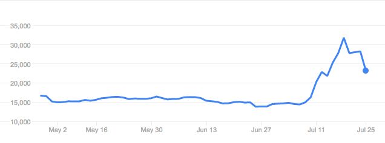

Nintendo's shares have soared in the last month since Pokemon Go was released.
On July 7th, Nintendo was valued at ~15 000 JPY per share, and as
of July 19th, Nintendo's shares were trading at ~32 000 JPY per share- a
100% increase in less than two weeks.

Nintendo released a [statement](https://www.nintendo.co.jp/ir/pdf/2016/160722e.pdf)
after the close of trading on Friday, July 22nd, noting that Nintendo owns 32%
of The Pokemon Company, which will receive a licensing fee from Niantic, the
company that owns Pokemon Go.

As a result, Nintendo's max revenue from Pokemon Go is:

Pokemon Go Revenue * (1 - share taken by Apple/Google) * (Share of Niantic's
revenue going to The Pokemon Company) * Share of Pokemon Co. owned by Nintendo

Which is roughly

Pokemon Go Revenue * 0.7 * X * 0.32 = Pokemon Go Revenue * 0.2 * X,

where X is the share of Niantic's revenue going to The Pokemon Company. Let's
assume that Niantic has extremely low costs, so that all of the revenue from
Pokemon Go is pure profit [^1], and let's assume that The Pokemon Company owns
half of Niantic, which is a pretty optimistic estimate of The Pokemon Company's
share. I'd be surprised if The Pokemon Company owned even 25% of Niantic.

With that assumption, Nintendo has a claim to 10% of Pokemon Go's revenues,
which means that even if Pokemon Go makes $1 billion annually, Nintendo will
receive an additional $100 million annually. Given Nintendo's historical P/E
ratio of 80 (which is, in my opinion, is very high), that means that as a hard
upper limit, Pokemon Go could add $8 billion to Nintendo's market cap--- a 20%
increase.

For context, Nintendo's share price has doubled.

Keep in mind that this assumption is based on Pokemon Go earning $1 billion
annually. That's a lot of lures. If Pokemon go is only making ("only") $1
million per day, for annual revenue of $360 million, Nintendo's share price
would increase by ~3 billion, which is an 8% increase. That's great,
particularly for a large corporation like Nintendo, but nowhere near the level
that the share price is at currently. So traders have a lot of correcting to do.

[^1]: That's actually not as insane of an assumption to make as one might think.
    Most of Niantic's costs come from paying salaries, which is a sunk cost, and a
    lot of the development work for Pokemon Go was done already for Ingress, so
    Niantic was able to produce Pokemon Go for less money than it would have taken
    for, say, Nintendo to build Pokemon Go from scratch.
