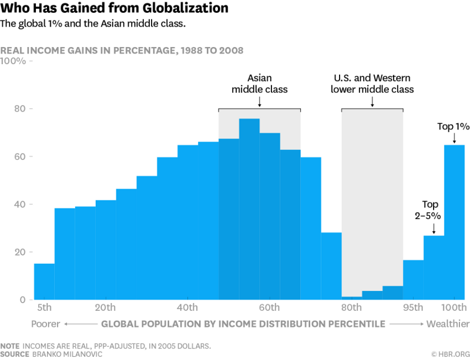

Article discussing how Trump is winning thanks to voters who have been harmed
by globalization [1].

The article has a stunning graph:

The point made by the article is reinforced by the academic literature ([2], [3])
which claims that inequality is driven by difference in skills. Medium-skilled
workers are making less money because their jobs are being automated. Think of
the typical accounting department in a large corporation circa 1950--- you'd
have teams of people doing simple math. Now, Excel has replaced that.
Low-skilled workers are unaffected as their jobs aren't valuable enough to
automate.

High-skilled analytical workers, on the other hand. are making much more money as
technology has radically enabled their work. Think of economics. It was next
to impossible to run 2 million regressions[5] in the 1950s, but now, any laptop
could do that no problem. As a result, economists are much more valuable.
Similarly for computer programmers.

[1]: https://medium.com/@boxerbk/confused-why-donald-trumps-message-is-resonating-1154c977697b?utm_content=buffer3a171&utm_medium=social&utm_source=facebook.com&utm_campaign=buffer#.zbwvkmmmx
[2]: http://science.sciencemag.org/content/344/6186/838?utm_content=bufferd9928&utm_medium=social&utm_source=facebook.com&utm_campaign=buffer
[3]: http://davidcard.berkeley.edu/papers/skill-tech-change.pdf?utm_content=buffer27cc7&utm_medium=social&utm_source=facebook.com&utm_campaign=buffer
[4]: https://www.newyorkfed.org/medialibrary/media/research/current_issues/ci18-7.pdf
[5]: http://www.nber.org/papers/w6252
