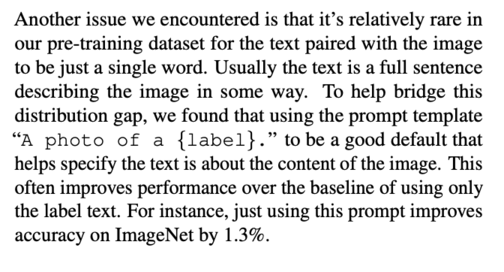

I collect weird examples of [prompt engineering](https://en.wikipedia.org/wiki/Prompt_engineering):

- The [CLIP](https://openai.com/blog/clip/) paper is full of examples, e.g.: 
- [Adding "Let's think step by step" before each answer increases the accuracy on MultiArith from 17.7% to 78.7%](https://twitter.com/arankomatsuzaki/status/1529278580189908993)
- [Constitutional AI](https://arxiv.org/abs/2212.08073) made answers less harmful by asking the model to choose the least harmful answer
