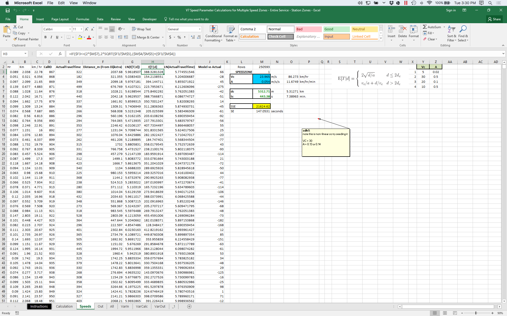
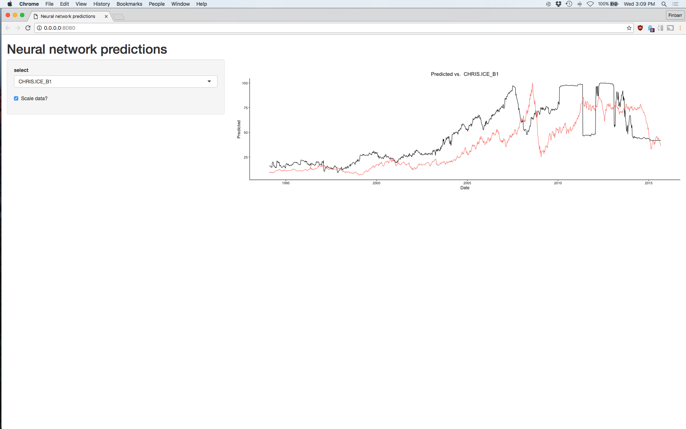

# Three stories.


## One: Moving a nonlinear regression from Excel to Python.



## One: Moving a nonlinear regression from Excel to Python.
The solution:


# But...

# "Hey Finbarr, can you help? The code doesn't seem to run."

# The solution?

# Fiddle with the computer for 20 minutes.

## Two: Sharing exploratory models


## Two: Sharing exploratory models




## Three: Running statistical model on client's system


# (If you're a consultant, this happens a lot).

## Three: Running statistical model on client's system

All we knew was:

1. We had access to a database.
2. We had to create an application that would talk to that database.

# The solution?

## Three: Running statistical model on client's system
1. Attend a series of meeting with the client's IT team discussing their
systems and our needs.
2. Write a comprehensive test suite that ensured every possible point of
failure was covered.
3. Pray.


# Is there a common thread?

## Problems
1. Unmet dependencies.
2. Undefined production environments.
3. Lengthy setup/install processes.

# If only there was something that could help us...

## An Ideal solution would be:
1. Portable. It works on every computer in the same way.
2. Easy to set up.
3. Easy to deploy.
4. Fast--- as close to running the code natively as possible.

---


## What is Docker?
- Allows for the creation of "containers"
- Containers are lightweight VMs that wrap up code with everything needed to
  run it
- "Write once run everywhere"
- Easy to write and use


# Let's revisit our three stories...

## One: Moving a nonlinear regression from Excel to Python.
- After we have the Python script (`nonlinear-regression.py`), add a Dockerfile:

```
FROM python:3.5.2-slim
RUN pip install numpy pandas pymssql
CMD python nonlinear-regression.py
```

- Time to build from scratch: 1:58.47
- Time to update Python code and rebuild: 0.629s
- Size: 648 MB (461.3 MB of that are the packages)

## Two: Sharing exploratory models
- Dockerfile:

```
FROM tensorflow/tensorflow

RUN pip install numpy sklearn pandas
ADD world_oil_forecast_data.csv /home
ADD model.py /home
WORKDIR /home
CMD python model.py
```

- Time to build from scratch: 2.55.19
- Size: 863.2 MB (mostly packages, but some upstream bloat).

## Three: Running statistical model on client's system
- Dockerfile:

```
FROM python:3.5.2-slim

# Install build-essential, git and other dependencies
RUN pip install numpy pandas sklearn \
    scipy pymssql hypothesis
ADD weighting_algorithm.py /home
ADD test_wa.py /home
WORKDIR /home
CMD python test_wa.py
```

- Time to build from scratch: 2:00.50
- Size: 681.3 MB (packages are 483.5 MB of that).

# Docker basics
## Dockerfiles:

```
FROM python:3.5.2-slim

RUN pip install numpy pandas sklearn scipy \
    pymssql hypothesis
ADD weighting_algorithm.py /home
ADD test_wa.py /home
WORKDIR /home
CMD python test_wa.py
```

# Dockerfiles

## 1. Base Image:

`FROM python:3.5.2-slim`


## 2. Directives:

```
RUN pip install numpy pandas sklearn scipy pymssql \
    hypothesis
ADD weighting_algorithm.py /home
ADD test_wa.py /home
WORKDIR /home
```

## 3. The command:

```
CMD python test_wa.py
```

## CLI Basics
- Once you have a Dockerfile, build a container with
`docker build -t weighting-algorithm .`

- This builds a container called `weighting-algorithm` from the file named
  `Dockerfile` sitting in your current folder (works similar to `Make`)

- Once built, run anywhere on your path with
`docker run weighting-algorithm`

## Example
- We have a Shiny app (R code that displays images in HTML)
- Code is in two files: `server.R` and `ui.R`, with three data files (`data.csv`,
`preds_actuals.csv`, `output.csv`).
- We run the app with the command `R -e 'shiny::runApp(".", host="0.0.0.0", port=8080)'`

- How can we turn this into a Docker container?

## Example

- Dockerfile:

```
FROM rocker/shiny

RUN R -e "install.packages(c('ggplot2'))"
ADD preds_actuals.csv /home
ADD data.csv /home
ADD output.csv /home
ADD server.R /home
ADD ui.R /home
WORKDIR /home
EXPOSE 8080
CMD R -e \
    'shiny::runApp(".", host="0.0.0.0", port=8080)'
```

## Example

- `docker build -t tf-shinyapp`
- `docker run -p 8080:8080 tf-shinyapp`

## One more thing...
We can instantly deploy this to Google's Cloud (assuming we
have a cluster running on Google Container Engine):

```
gcloud docker push \
    gcr.io/applied-ridge-137723/tf-shinyapp
kubectl run tf-shinyapp \
    --image=gcr.io/applied-ridge-137723/tf-shinyapp \
    --port=8080
kubectl expose deployment \
    tf-shinyapp --type="LoadBalancer"
kubectl get service tf-shinyapp
```

## Summary
